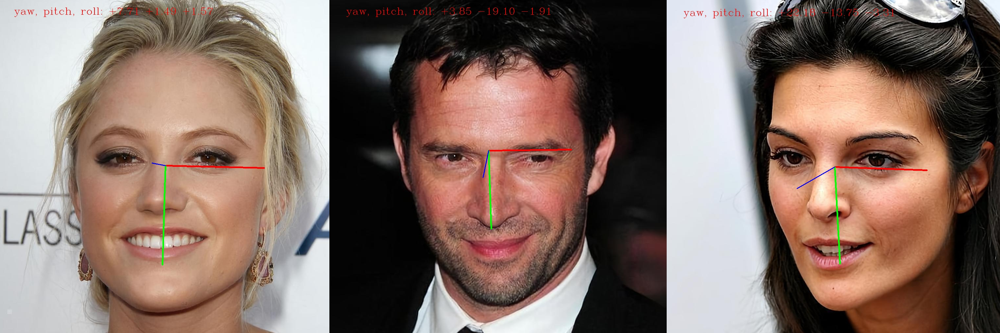

# headpose estimation

<div align="center">
<br><br>
</div>

**Hopenet** is an accurate and easy to use head pose estimation network. Models have been trained on the 300W-LP dataset and have been tested on real data with good qualitative performance.

For details about the method and quantitative results please check the CVPR Workshop [paper](https://arxiv.org/abs/1710.00925).

<div align="center">
<br><br>
</div>


# understand the euler angles
### the output is: [yaw, pitch, roll]
`yaw(red) ∈ [-180, 180]`: represent face left & right rotation, left -, right +

`pitch(green) ∈ [-90, 90]`: represent head up & down move, up +, down -

`roll(blue) ∈ [-180, 180]`: represent head left & right shake, head close to left shoulder +, head close to right shoulder - 

<div align="center">
<br><br>
</div>


# How to use

### environment:python2.7 (I recommend virtualenv)
to use the `virtualenv`
    
    pip install virtualenv

set up and activate a virtual environment
    
    virtualenv headpose --python=2.7
    source ./headpose/bin/activate

install the packages:

    pip install -r requirentments_python27.txt

### download the pretrained model
from the original author: (then put the pre-trained model in src folder)

[300W-LP, alpha 1, robust to image quality](https://drive.google.com/open?id=1m25PrSE7g9D2q2XJVMR6IA7RaCvWSzCR)

## test on an image folders

    python headpose_estimation_imageFolder.py -i ~/path/to/yours/
for more information:
    
    python headpose_estimation_imageFolder.py -h

## calculate the `Euler-angle's` L2 distance between two images:

you should change the source code in `headpose_estimation_pairs_celeba_ffhq.py`, here I give an example:

    python headpose_estimation_pairs_celeba_ffhq.py celeba c3net  


## Other pre-trained models:
(all the following messages are from the original Github repo)

[300W-LP, alpha 1](https://drive.google.com/open?id=1EJPu2sOAwrfuamTitTkw2xJ2ipmMsmD3)

[300W-LP, alpha 2](https://drive.google.com/open?id=16OZdRULgUpceMKZV6U9PNFiigfjezsCY)

[300W-LP, alpha 1, robust to image quality](https://drive.google.com/open?id=1m25PrSE7g9D2q2XJVMR6IA7RaCvWSzCR)


# Acknowledgment

Thanks for the authors great work: https://github.com/natanielruiz/deep-head-pose

If you find Hopenet useful in your research please cite:

```
@InProceedings{Ruiz_2018_CVPR_Workshops,
author = {Ruiz, Nataniel and Chong, Eunji and Rehg, James M.},
title = {Fine-Grained Head Pose Estimation Without Keypoints},
booktitle = {The IEEE Conference on Computer Vision and Pattern Recognition (CVPR) Workshops},
month = {June},
year = {2018}
}
```

*Nataniel Ruiz*, *Eunji Chong*, *James M. Rehg*

Georgia Institute of Technology
